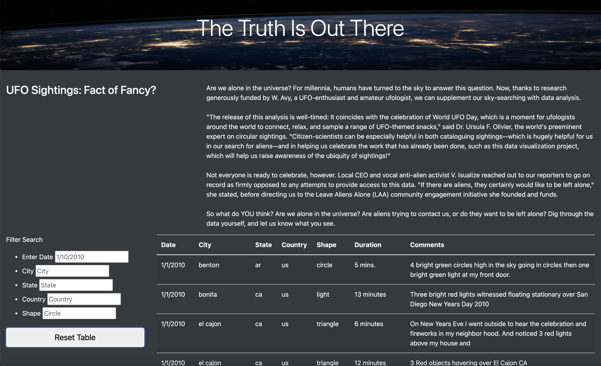
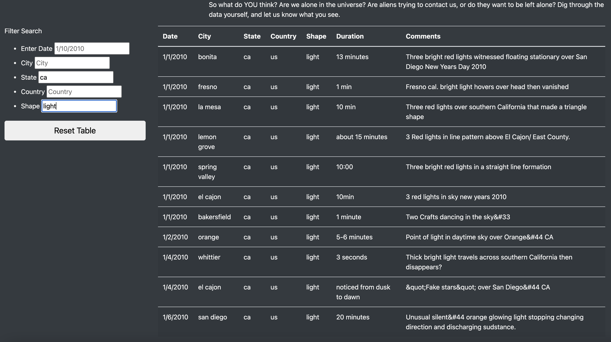

# UFOs - Are We Alone in the Universe? 

## Overview of Project: 
We created a webpage and dynamic table to provide an in-depth analysis of UFO sightings. The table allows users to filter for multiple UFO sighting criteria at the same time. These creitera include date of the sighting, city, state, and country of the incident, and shape of the unidentified object.

## Results:
Users who visit this website will be greeted with a bit of information about UFO sightings around the world. These sightings are listed in a table on the site that, by default, shows all the sightings and lists the known information. Visitors to the site can use the text boxes to the left of the page to enter criteria that when typed in and "enter" is pressed, will return the filtered data to the table. The search Filters are shown below. 

  

Once criteria as been entered into a text box, the table will populate with the data that meets the given filter. For example, if I wanted to look at all the UFOs that were described as “light” shaped that have been sighted in California, I would enter "ca" into the 'State" filter box and "light" into the 'Shape' filter box, and then I would press the enter key. The following results would populate the table: 

  

Once you have filtered the data, if you would like to reset the table back to the default with all the data included, you can click on the "Reset Table" button located below the search criteria. 

You can interact with the website here: 

https://jheuer22.github.io/UFOs/

## Summary: 

The improved website allows for more specific searches of the dataset on the UFO sightings. I included a reset button so that the table could be reset without the need for refreshing the entire page to restore all the data to the table. 

Some additional features that could be added to increase the ease of sorting could include adding drop down menus to some of the filters. For example, the state, country, and shape criteria would make sense to be filtered with a drop-down menu instead of a text box. 

Additional features to improve the site could also include additional code that would help make the text that is entered match the data more broadly. For example, if someone types in "California" or "CA", it would be redirected to 'ca' in the dataset. Another helpful feature would be to add a portion of code that would add a "no results found" message if no data matched the filter criteria. These small additions would make for a much more user friendly website. 

