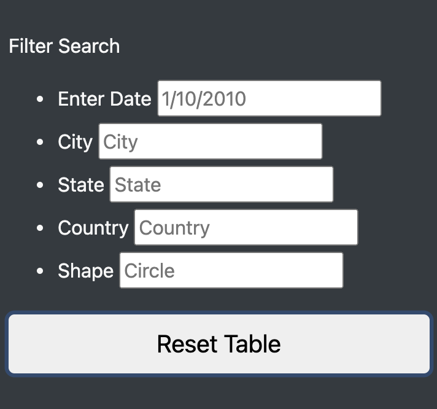

# UFOs - Are We Alone in the Universe? 

## Overview of Project: 
We created a webpage and dynamic table to provide an in-depth analysis of UFO sightings. The table allows users to filter for multiple UFO sighting criteria at the same time. These creitera include date of the sighting, city, state, and country of the incident, and shape of the unidentified object.

## Results:
Users who visit this website will be greeted with a bit of information about UFO sightings around the world. These sightings are listed in a table on the site that, by default, shows all of the sightings and lists the known information. Visitors to the site can use the text boxes to the left of the page to enter criteria that when typed in and "enter" is pressed, will return the filtered data to the table. The search Filters are shown below. 

  

For
You can interact with the website here: 

https://jheuer22.github.io/UFOs/

## Summary: 

In a summary statement, describe one drawback of this new design and two recommendations for further development.

